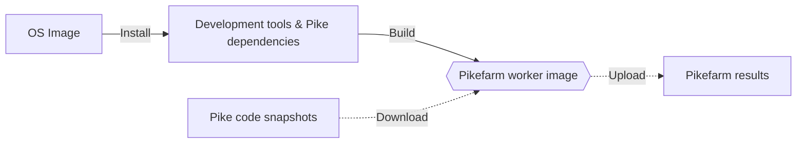

# Pikefarm workers

These are container images for running the [Pikefarm](http://pike.lysator.liu.se/development/pikefarm/) projects.

These containers contains :

* the developement tools required to build Pike from source ;
* the dependencies for building Pike features (WIP);

These images *don't* contain a Pike interpreter. Please use [Pike Docker container images](https://github.com/bertrand-lupart/docker-pike) instead.

## Usage
